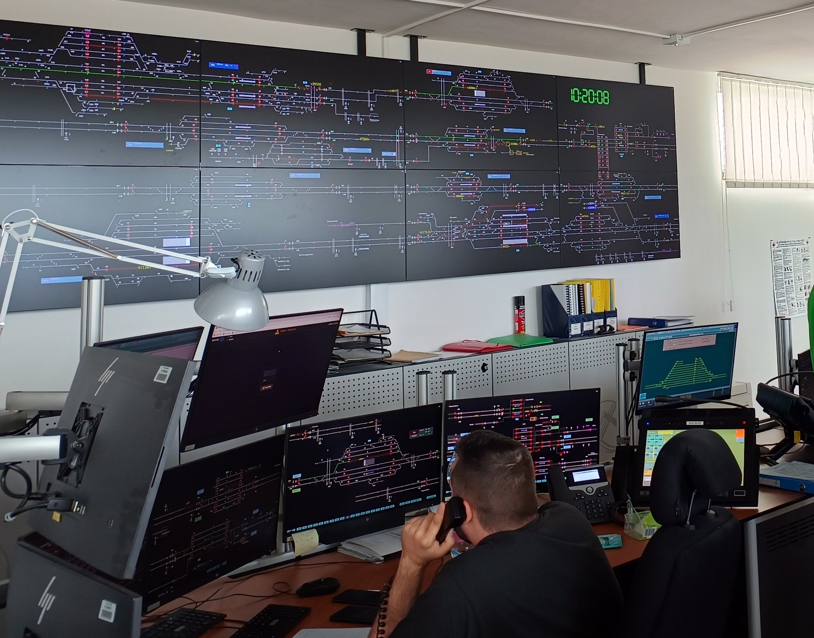

Hogyan lehet forgalmat irányítani, és a késéseket automatizált megoldásokkal csökkenteni? Mit hozhatnak az új technológiák a vasúti forgalomirányításban? 
Az automatizált megoldások kifejlődése, biztosítóberendezési és mozdonyszimulátor bemutató a hatékony vasúti közlekedésért.

[Lövétei István Ferenc](https://tudprog.bme.hu/kutatok_ejszakaja/profilok/lovetei_istvan_ferenc), [Dr. Komócsin Zoltán](https://tudprog.bme.hu/kutatok_ejszakaja/profilok/komocsin_zoltan), [Farkas Balázs](https://tudprog.bme.hu/kutatok_ejszakaja/profilok/farkas_balazs)

BME KJK, [Közlekedés- és Járműirányítási Tanszék](https://kjit.bme.hu/index.php/hu/) 

