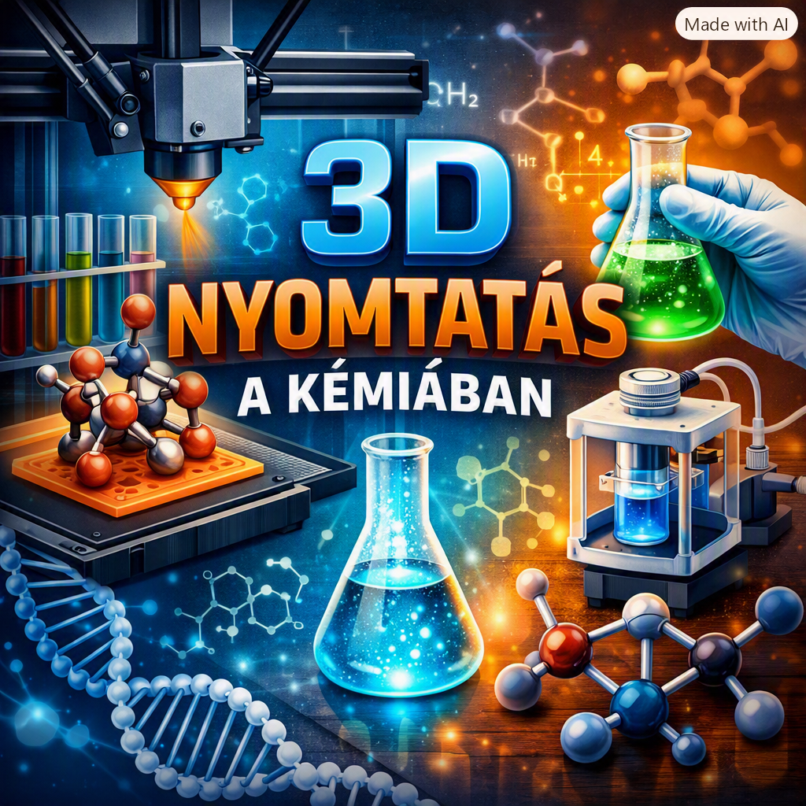

Hogyan formálja át a 3D nyomtatás a modern kémiát? Gyere el és nézd meg a molekulamodellek, egyedi reakcióedények és áramlásos kémiai reaktorok nyomtatását és alkalmazását kémiai kísérletekben. 

[Dr. Bálint Erika](https://tudprog.bme.hu/kutatok_ejszakaja/profilok/balint_erika), [Orosz János Máté](https://tudprog.bme.hu/kutatok_ejszakaja/profilok/orosz_janos_mate), [Gyöngyössy Ádám](https://tudprog.bme.hu/kutatok_ejszakaja/profilok/gyongyossy_adam), [Heller Bence](https://tudprog.bme.hu/kutatok_ejszakaja/profilok/heller_bence)

[BME VBK, Szerves Kémia és Technológia Tanszék](https://oct.bme.hu/oct/hu)

