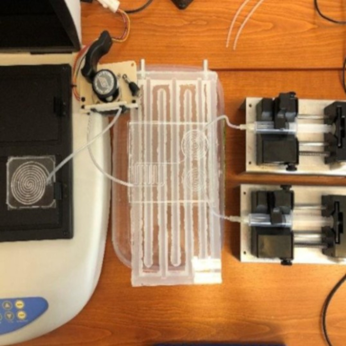

A program során a laborban mutatjuk be a kutatásunkhoz kapcsolódó, nanorészecskékből álló bioszenzorokat, röviden ismertetve az elméleti hátteret és működési elvet. Ehhez kötődnek a mikrofluidikai rendszerek, valamint az előállításukat biztosító 3D nyomtatási technológiák.

[Kovács Rebeka](https://tudprog.bme.hu/kutatok_ejszakaja/profilok/kovacs_rebeka), [Tarpataki Nóra](https://tudprog.bme.hu/kutatok_ejszakaja/profilok/tarpataki_nora)

[BME VIK, Elektronikai Technológia Tanszék](https://www.ett.bme.hu/)

