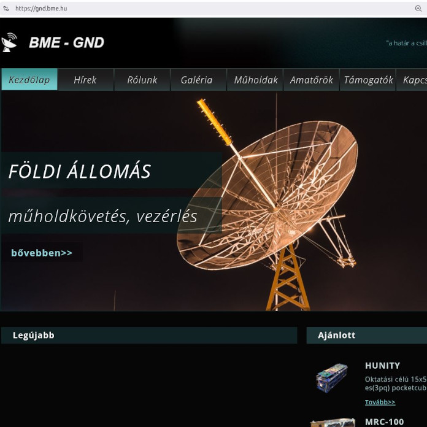

Műegyetemi műholdvezérlő földi állomás látogatás, amely során az eddigi műegyetemi kisműholdak, valamint a műholdak üzemeltetése is bemutatásra kerülnek.

[Dr. Dudás Levente](https://tudprog.bme.hu/kutatok_ejszakaja/profilok/dudas_levente), [Herman Tibor](https://tudprog.bme.hu/kutatok_ejszakaja/profilok/herman_tibor), [Hödl Emil](https://tudprog.bme.hu/kutatok_ejszakaja/profilok/hodl_emil), [Püspöki Péter](https://tudprog.bme.hu/kutatok_ejszakaja/profilok/puspoki_peter) 

[BME VIK, Szélessávú Hírközlés és Villamosságtan Tanszék](https://hvt.bme.hu/)

