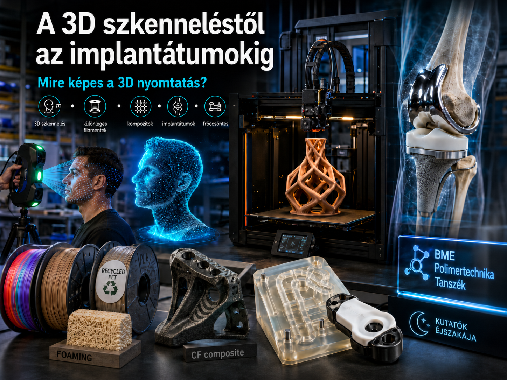

A 3D nyomtatás ma már nemcsak látványos hobbi: egyedi alkatrészek, kompozit szerkezetek, orvosi implantátumok, sőt akár gyártóeszközök is készülhetnek vele. De hogyan lesz egy valódi tárgyról vagy akár egy emberről digitális 3D modell? A program során ezt is megmutatjuk: egy önként jelentkező látogató fejéről 3D szkennerrel digitális modellt készítünk.
A laborlátogatás során a résztvevők többféle 3D nyomtatási technológiával és különleges alapanyaggal is találkozhatnak. Megmutatunk többek között színváltó, fával töltött, újrahasznosított PET-palackból készült és nyomtatás közben felhabosodó filamenteket, valamint azt is, hogyan készíthetők folytonos szálerősítésű kompozit alkatrészek. Betekintést adunk a műgyantás 3D nyomtatás különböző technológiáiba, megmutatjuk, hogyan használhatók 3D nyomtatott szerszámbetétek a fröccsöntésben, és hogyan lehet egy 3D nyomtatott elemre további anyagot ráfröccsönteni. 
Emellett néhány, ízületi implantátumokhoz kapcsolódó kutatási alkalmazást is bemutatunk.

[Dr. Tomin Márton](pt.bme.hu/munkatarsadatlap.php?id=5d6q84jc5cbz83n5s2er385v647s56o44n57mg46&l=m), [Dr. Kovács Norbert Krisztián](https://www.pt.bme.hu/munkatarsadatlap.php?id=j2j3e454q78eqxmsstuvb3639ho6B799bpp6kbh9&l=m),
[Nemes-Károly István](https://www.pt.bme.hu/munkatarsadatlap.php?id=725cAB3m2z29r2q38472d978Bz8u8n3uvh435758&l=m), [Dr. Krizsma Szabolcs](pt.bme.hu/munkatarsadatlap.php?id=9e5sA7h66h6f7rwbn2bwB97u4jq543894f6mm893&l=m), [Kunsági Viktóra](https://www.pt.bme.hu/munkatarsadatlap.php?id=7580FG8qkvu44hFe1xHD350S42sXC40A1mAbYd4s&l=m)

[BME GPK Polimertechnika Tanszék](https://www.pt.bme.hu/fooldal.php?l=m)

