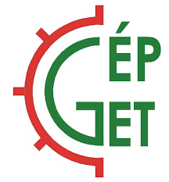

A Kutatók Éjszakáján megnyitjuk a BME Épületgépészeti és Gépészeti Eljárástechnika Tanszékének Stokes Laborját. Az este folyamán a Tanszék oktatói és hallgatói mutatják be a működésben lévő kísérleti laborberendezéseket. 

[Dr.Szánthó Zoltán](https://epget.bme.hu/wp/munkatarsak/szantho-zoltan/) 

[BME GPK, Épületgépészeti és Gépészeti Eljárástechnika Tanszék](https://epget.bme.hu/wp/)

