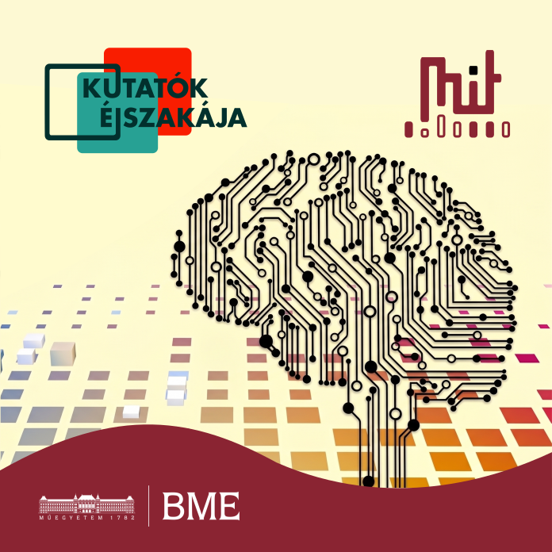

Azt hiszed, a mesterséges intelligencia csak a házi feladat megírására jó? Ez csak a kezdet! Az előadáson bemutatjuk, miként válnak önálló ágenssé játékokban, robotokat irányítva vagy a mindennapokban – és milyen kihívásokat hoz ez a jövő.

[Mészáros Tamás Csaba](https://tudprog.bme.hu/kutatok_ejszakaja/profilok/meszaros_tamas_csaba), [Potyók Csaba](https://tudprog.bme.hu/kutatok_ejszakaja/profilok/potyok_csaba), [Ágota Benedek](https://tudprog.bme.hu/kutatok_ejszakaja/profilok/agota_benedek)

[BME VIK, Mesterséges Intelligencia és Rendszertervezés Tanszék](https://www.mit.bme.hu/)

