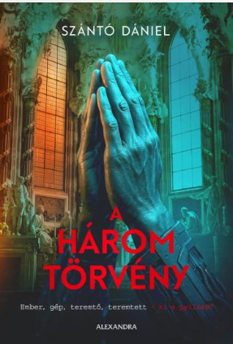

Kerekasztal-beszélgetésünk témája a kortárs irodalom és az MI találkozása. Beszélgetésünk meghívott vendége Szántó Dániel író, akivel A három törvény című műve kapcsán beszélgetünk karrierről, irodalomról, oktatásról, és a mesterséges intelligencia társas kapcsolatainkra gyakorolt hatásáról.

[BME GTK Műszaki Pedagógia Tanszék](https://www.mpt.bme.hu/)

