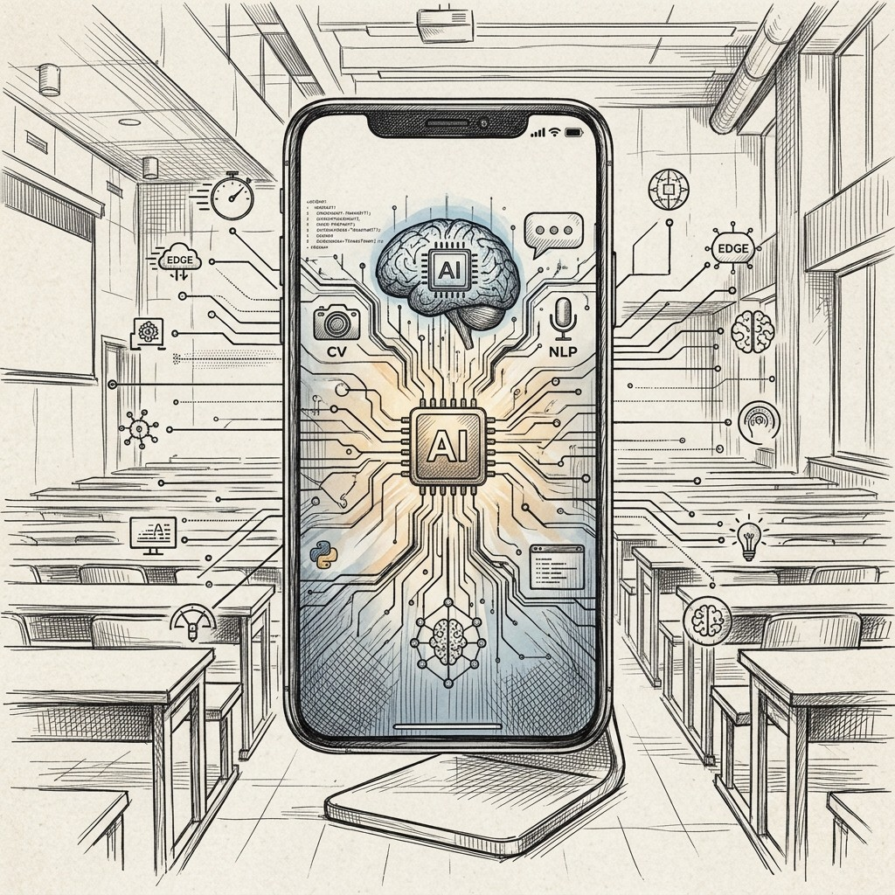

A program során áttekintjük a mobiltelefonok technológiai fejlődését, mely rengeteg új lehetőséget nyitott meg a fejlesztők és felhasználók számára. Egy előadás, illetve rövid demók segítségével bemutatjuk, hogy milyen mesterségesintelligencia-alapú szolgáltatások érhetőek el az eszközökön, és mik ezek leggyakoribb felhasználási módjai.

[Domonkos Ádám](https://tudprog.bme.hu/kutatok_ejszakaja/profilok/domonkos_adam), [Pásztor Dániel](https://tudprog.bme.hu/kutatok_ejszakaja/profilok/pasztor_daniel)

[BME VIK, Automatizálási és Alkalmazott Informatikai Tanszék](https://www.aut.bme.hu/)

