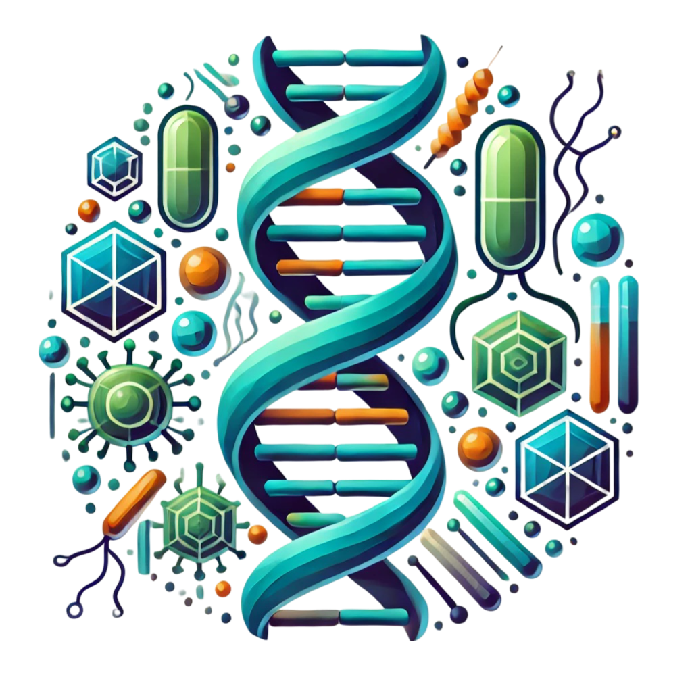

A “Legyél te is biomérnök!” programsorozat részeként interaktív workshop a Biostruct labor előtti folyosón: a játékok regisztráció nélkül is kipróbálhatók. 
A regisztrált érdeklődők bepillantást nyernek egy fehérjekristályosító labor életébe.

[Dr. Békési Angéla](https://tudprog.bme.hu/kutatok_ejszakaja/profilok/bekesi_angela), Emődi Nikolett, Iván Réka, Oláh Eszter, Szajkó Milda: A Genom Metabolizmus és Biostruct Kutatócsoport lelkes fiatal kutatói, doktoranduszai és MSc-s diákjai. 
A csoport kutatási és oktatási tevékenységéről a honalpjainkon lehet tájékozódni: [Biostruct](https://www.biostruct.org/) és [Genom metabolizmus kutatócsoport](https://www.ttk.hun-ren.hu/ei/genom-metabolizmus-kutatocsoport). Továbbá a BME VBK ABÉT insta és facebook oldalán találhattok egy rövid bemutatkozást: [Instagram](https://www.instagram.com/p/C_fSLQoovmX/?igsh=cXBjZ2pkdXh1bDJq) és [Facebook](https://www.facebook.com/share/p/iwCxi83ubJKME1Mr/)

[BME VBK, Alkalmazott Biotechnológia és Élelmiszertudományi Tanszék](https://abet.vbk.bme.hu/)

