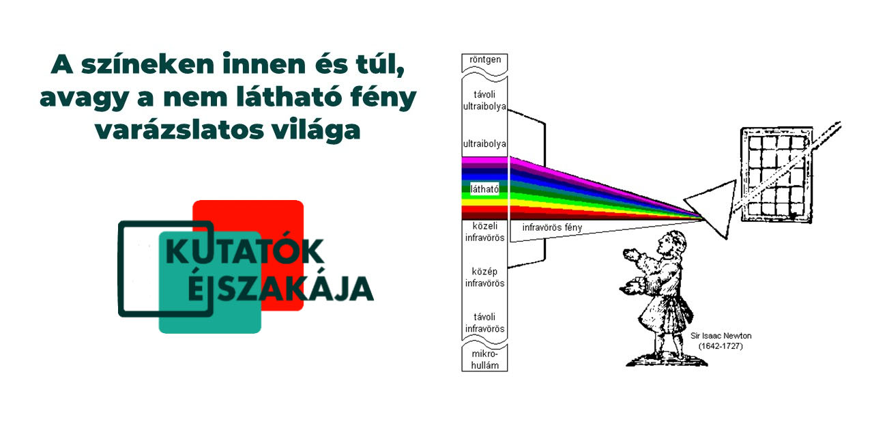

Tudtad, hogy a fehér fényben van a legtöbb szín? És hogy mi van ott, amit nem látunk, a vörös alatt és az ibolyán túl? Elég jó a szemed, hogy lásd az árnyalatnyi különbségeket? És ha elfárad, hogy látnak a gépek helyetted? A színeken inneni és túli világokat is bemutatjuk olyan példákon keresztül, ami minden nap körülvesz - hogy láss, ne csak nézz.

[Dr. Gergely Szilveszter](https://tudprog.bme.hu/kutatok_ejszakaja/profilok/gergely_szilveszter), [Slezsák János](https://tudprog.bme.hu/kutatok_ejszakaja/profilok/slezsak_janos), [Madács Ágnes](https://tudprog.bme.hu/kutatok_ejszakaja/profilok/madacs_agnes)

[BME VBK, Alkalmazott Biotechnológia és Élelmiszertudományi Tanszék](https://abet.vbk.bme.hu/)

