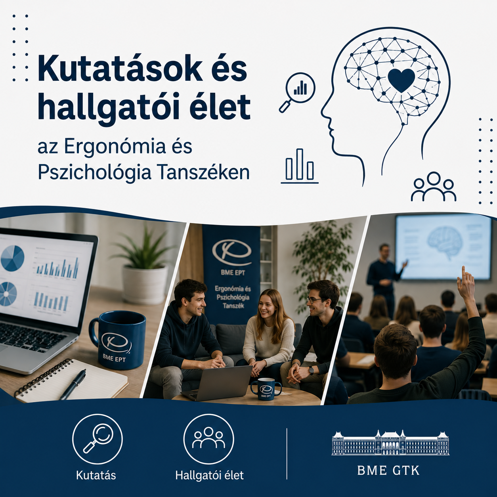

A BME Ergonómia és Pszichológia Tanszék legújabb hallgatói kutatásait BSc, MSc és PhD képzési szinteken tanuló hallgatóink mutatják be a termék- és szolgáltatásfejlesztés, valamint a pénzügyi és mentális jóllét témaköreiben, és mesélnek a Tanszék hallgatói életéről és közösségéről.

Az eseményt mindenkinek előszeretettel ajánljuk, aki érdeklődik a legújabb hallgatói kutatások iránt, vagy gondolkodik az akadémiai pályán, és kíváncsi az abban rejlő lehetőségekre.

Programterv:

- Dr. Tóvölgyi Sarolta (tanszékvezető-helyettes): Ismerd meg a BME GTK Ergonómia és Pszichológia Tanszékét!

- Bokányi Bettina (műszaki menedzser BSc-hallgató)
A LEGO Botanicals termékcsalád megítélésének vizsgálata kvantitatív és kvalitatív úton

- Rabovszky Amanda (műszaki menedzser MSc-hallgató)
Rovaralapú élelmiszerek megítélésének és csomagolásának vizsgálata conjoint analízissel

- Balogh Csenge (Gazdálkodás- és Szervezéstudományi Doktori Iskola PhD-hallgató)
A pénzügyi jóllét szubjektív megítélése és a mentális egészség kapcsolata

- Kutatói lét és hallgatói élet az Ergonómia és Pszichológia Tanszéken (Kérdések és válaszok)

[Dr. Szabó Bálint](https://tudprog.bme.hu/kutatok_ejszakaja/profilok/szabo_balint), [Dr. Tóvölgyi Sarolta](https://tudprog.bme.hu/kutatok_ejszakaja/profilok/tovolgyi_sarolta), [Bokányi Bettina](https://tudprog.bme.hu/kutatok_ejszakaja/profilok/bokanyi_bettina), [Rabovszky Amanda](https://tudprog.bme.hu/kutatok_ejszakaja/profilok/rabovszky_amanda), [Balogh Csenge](https://tudprog.bme.hu/kutatok_ejszakaja/profilok/balogh_csenge)

[BME GTK, Ergonómia és Pszichológia Tanszék](https://edu.gtk.bme.hu/course/index.php?categoryid=5)

