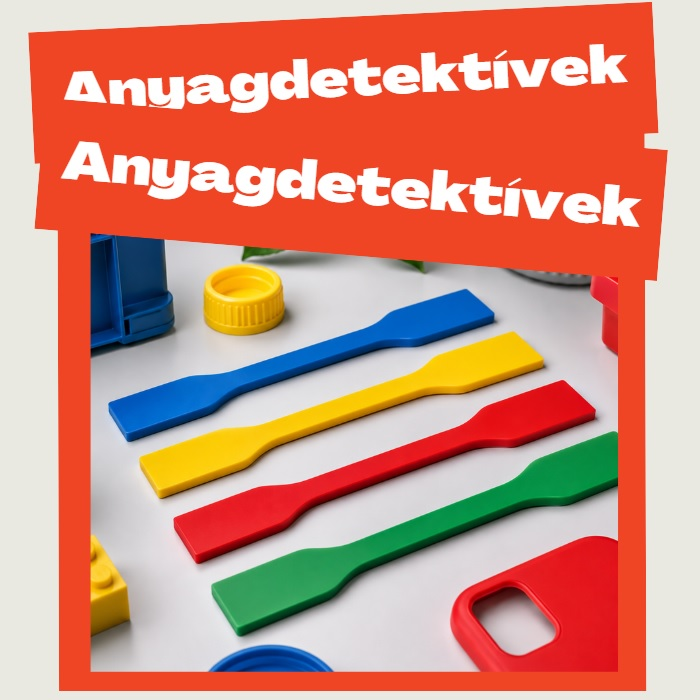

Vajon fel tudod ismerni a különböző műanyagokat? Meg tudod mondani, melyik bioműanyag, melyik újrahasznosítható, és melyiknek mi lesz a sorsa használat után? 
Légy egy estére műanyagdetektív, és vizsgáld meg a bizonyítékokat!

[Dr. Litauszki Katalin](https://www.pt.bme.hu/munkatarsadatlap.php?id=n9b29A5n7f39xh3wuhA8bB669j96bB4z674439t9&almenu=1&l=m)

[BME GPK Polimertechnika Tanszék](https://www.pt.bme.hu/fooldal.php?l=m)

