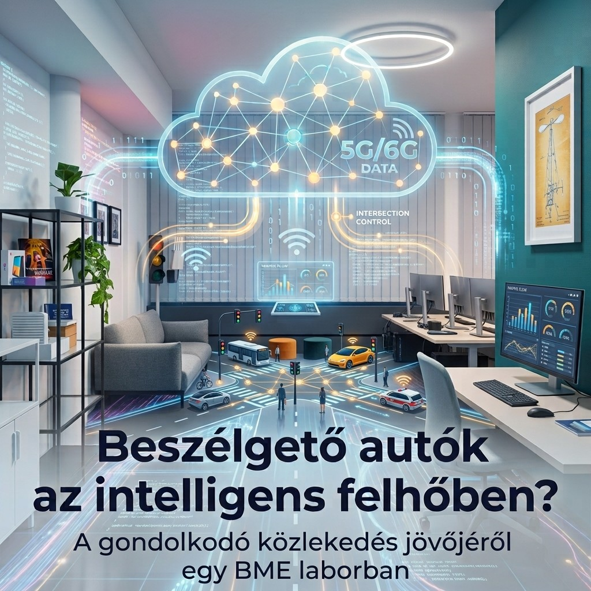

Mit mondanak egymásnak az okos autók? Hogyan segítik egymást, és mi történik közben a felhőben? A BME HIT Kovács „Jos” József Járműinformatikai és Járműkommunikációs Hallgatói Laboratóriumában bepillantunk a jövő összekapcsolt közlekedésébe.

[Dr. Bokor László](https://medianets.hu/munkatarsak/bokor-laszlo/)

[BME VIK, Hálózati Rendszerek és Szolgáltatások Tanszék](https://www.hit.bme.hu/)

