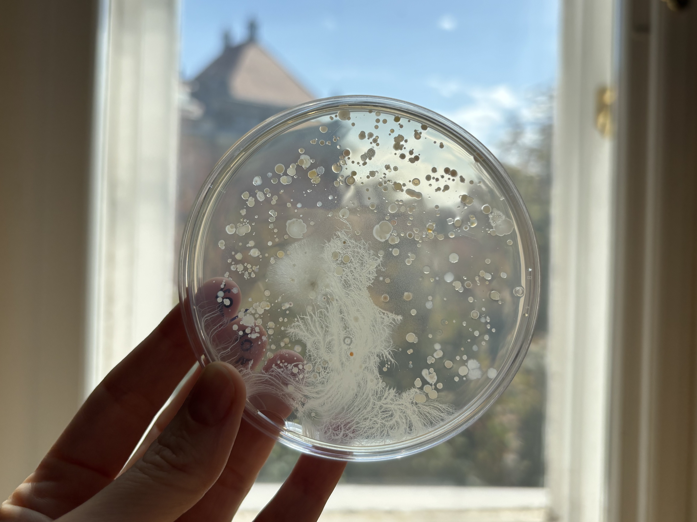

Kíváncsi vagy, hogy milyen apró élőlények vesznek minket körül? Hogyan beszélgetnek egymással? Milyen egy világító baktérium? Hogyan hatnak rájuk a mikroműanyagok? 
Ismerd meg a BME Környezeti Mikrobiológia és Környezettoxikológia laboratóriumának titkait! Legyél Te is biomérnök!

[Dr. Feigl Viktória](https://tudprog.bme.hu/kutatok_ejszakaja/profilok/feigl_viktoria_dora), [Dr. Molnár Mónika](https://tudprog.bme.hu/kutatok_ejszakaja/profilok/molnar_monika), [Kese István](https://tudprog.bme.hu/kutatok_ejszakaja/profilok/kese_istvan), [Lassu Dominika](https://tudprog.bme.hu/kutatok_ejszakaja/profilok/lassu_dominika)

[BME VBK, Alkalmazott Biotechnológia és Élelmiszertudományi Tanszék](https://abet.vbk.bme.hu/)

