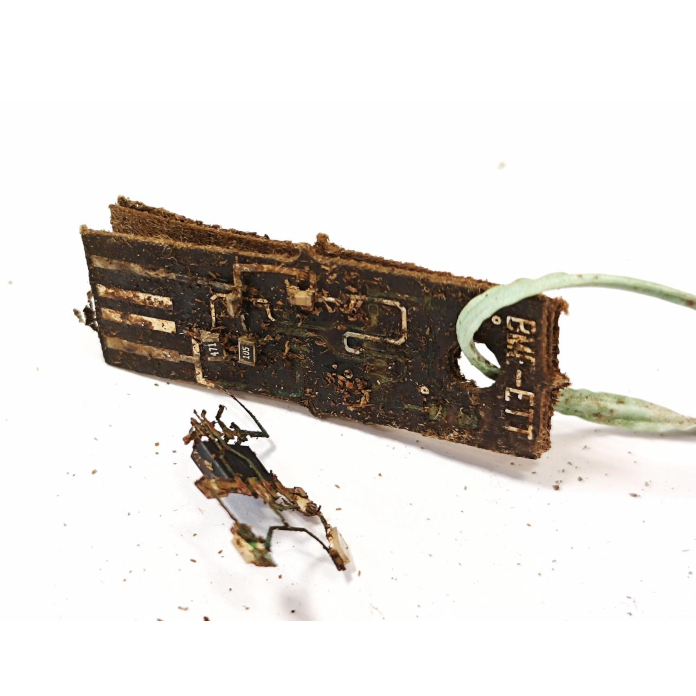

Testközelből bemutatjuk a tanszék és partnerei által kifejlesztett komposztálható elektronikai áramköröket, azok vizsgálati módszereit, a kutatásaink jelenlegi állását. Ismerje meg a világszinten is a legjobb kettő közé tartozó egyedülálló innovációt!

[Dr. Farkas Csaba](https://tudprog.bme.hu/kutatok_ejszakaja/profilok/farkas_csaba)

[BME VIK, Elektronikai Technológia Tanszék](https://www.ett.bme.hu/)

