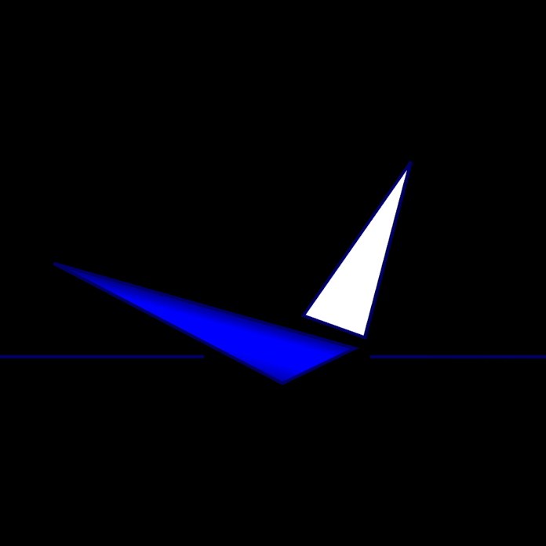

A dróntechnológia egyszerre szórakozás, mérnöki kihívás, kutatási terület, és gyorsan fejlődő iparág. 
A repülő szerkezetek mögött összetett rendszerek, új alkalmazások, piaci lehetőségek és a hatékonyságot meghatározó aktuális műszaki kérdések állnak.

[Hus Máté Olivér](https://tudprog.bme.hu/kutatok_ejszakaja/profilok/hus_mate_oliver), [Fendrik Ármin](https://tudprog.bme.hu/kutatok_ejszakaja/profilok/fendrik_armin)

[BME KJK, Repüléstudományi és Hajózási Tanszék](http://rht.bme.hu/hu/)

