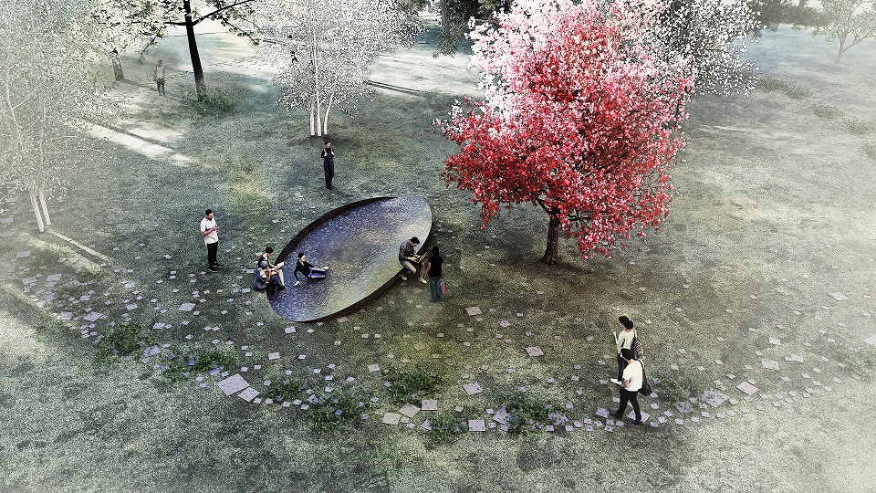

Az első magyar mérnöknő tiszteletére készült ligetben emlékfát fogunk ültetni, valamint felavatjuk a közösségi összefogással elkészült kerengőt. A Műegyetem emlékezeti terében mérnöknők eddig egyáltalán nem jelentek meg, így alakult az emlékliget ötlete, melynek idén nyáron az első szakasza, a kerengő valósult meg a BME EMK, EPK, az Építész Szakkollégium és a Pro Progressio Alapítvány segítségével.

[Dallos Györgyi](https://www.mit.bme.hu/munkatarsak/dallos_gyorgyi), [Alföldi György](https://www.mit.bme.hu/munkatarsak/alfoldi_gyorgy), [Kőhalmy Nóra](https://www.mit.bme.hu/munkatarsak/kohalmy_nora), [Rab Enikő Sarolta](https://www.mit.bme.hu/munkatarsak/rab_eniko_sarolta)

[BME](https://www.mit.bme.hu/)

