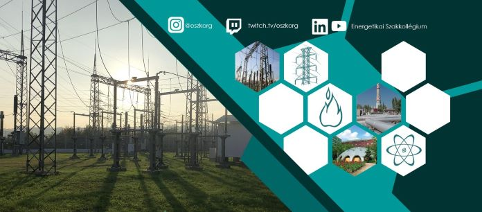

Az [Energetikai Szakkollégium]( https://www.eszk.org) a Budapesti Műszaki és Gazdaságtudományi Egyetem hallgatóiból alakult szakmai szervezet, amely 2002 óta összeköti az ipari, tudományos és egyetemi világot. Minden félévben aktuális energetikai témákban szervez nyilvános előadásokat és üzemlátogatásokat, valamint tagjai számára belső soft- és hardskill kurzusokat, projekteket és nemzetközi konferenciákon való részvételi lehetőséget is kínál.

Teszteld az energetikai tudásod, pörgesd meg a szerencsekereket, és nyerj ESZK-s ajándékokat! Emellett látványos DIY kísérletekkel, köztük egy Jákob létrával is várunk.

[Galó András](https://tudprog.bme.hu/kutatok_ejszakaja/profilok/galo_andras), [Szabó Jázmin](https://tudprog.bme.hu/kutatok_ejszakaja/profilok/szabo_jazmin)

[BME GPK, Energetikai Gépek és Rendszerek Tanszék](https://www.energia.bme.hu/)

