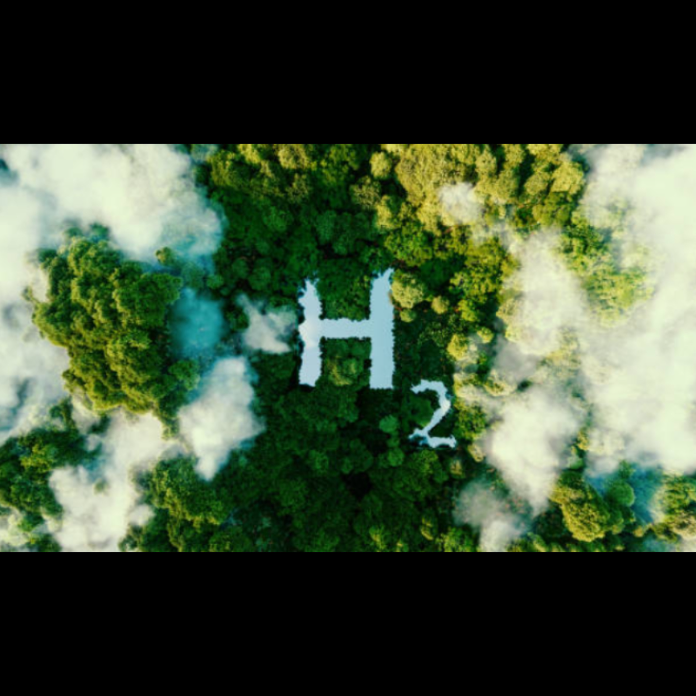

Fedezd fel a hidrogéncellák izgalmas világát! Tanulj meg mindent arról, hogyan alakítják át a hidrogént tiszta, hatékony üzemanyaggá, és tudd meg, hogyan járulhatnak hozzá a fenntartható jövőhöz!

[BME GPK, Energetikai Gépek és Rendszerek Tanszék](https://www.energia.bme.hu/)

