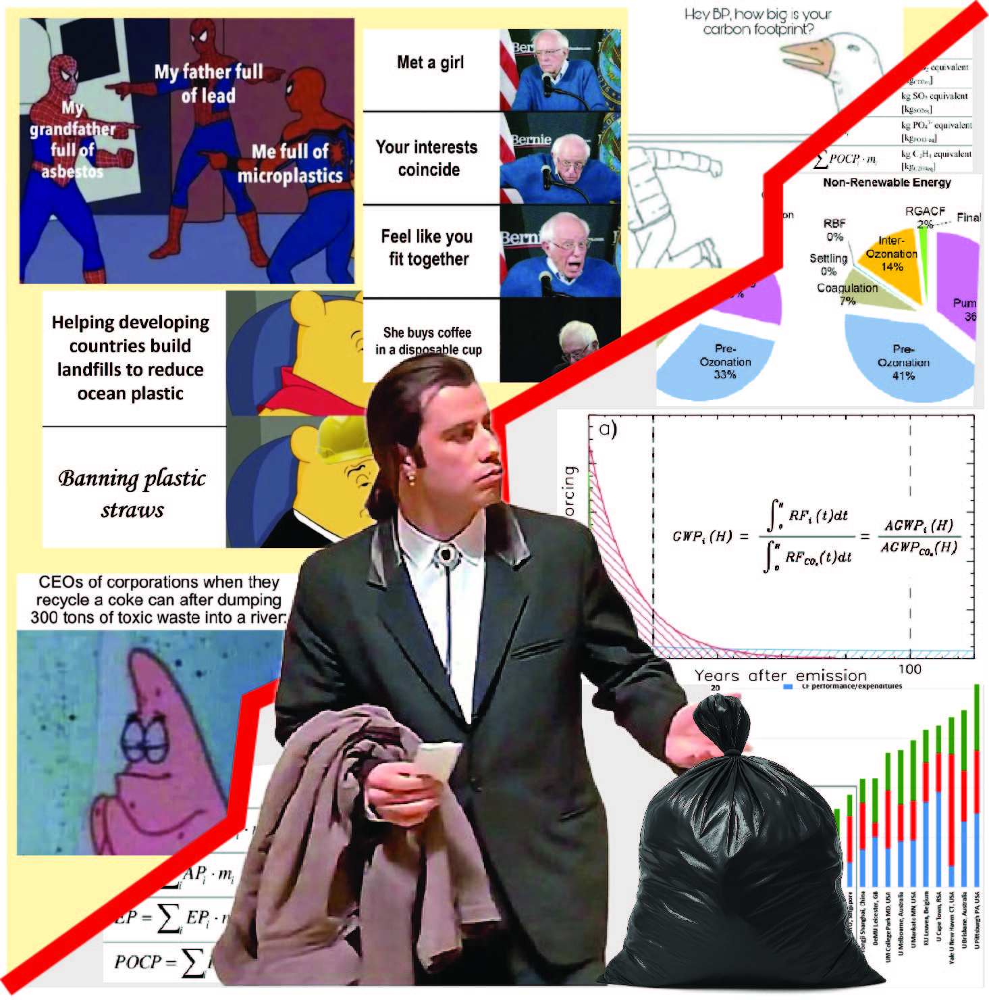

Interaktív műhelyünkben hulladékgazdálkodási játékra invitálunk, amely során te irányítod a hulladék útját, tesztelheted tudásod, és közben megismerheted a hulladékkezelés, hulladékhasznosítás, újrahasznosítás és fenntarthatóság kevésbé ismert oldalait.

[Dr. Tóth Csenge](http://www.pt.bme.hu/munkatarsadatlap.php?id=569w9t99crk8q539s9jA7kt4zh52mmt3789kjdB7&l=m), [Dr. Virág Ábris Dávid](http://www.pt.bme.hu/munkatarsadatlap.php?id=8kB22c5k66jt8d63s388mh2yshzutdd2m38wwxjk&l=m), 
[Nagy Róbert](https://www.pt.bme.hu/munkatarsadatlap.php?id=24zt4273k7544r2f4f3rht8u46tyx2m2x92r3493&l=m), [Csapó Maja](http://www.pt.bme.hu/munkatarsadatlap.php?id=8n9m6c3n5dvs9htm3A52y59g4826bym3c6np7mvc&l=m)

[BME GPK Polimertechnika Tanszék](https://www.pt.bme.hu/fooldal.php?l=m)

