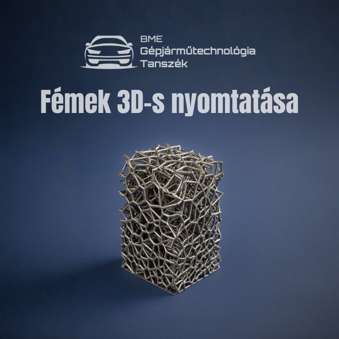

Egy korszerű megmunkálási eljárás kerül bemutatásra: porágyas lézersugaras fém nyomtatás, gyártás folyamata és nyomtatott modellek.

[Dr. Varga Ferenc László](https://tudprog.bme.hu/kutatok_ejszakaja/profilok/varga_ferenc_laszlo)

[BME KJK, Gépjárműtechnológia Tanszék](https://auto.bme.hu/)

