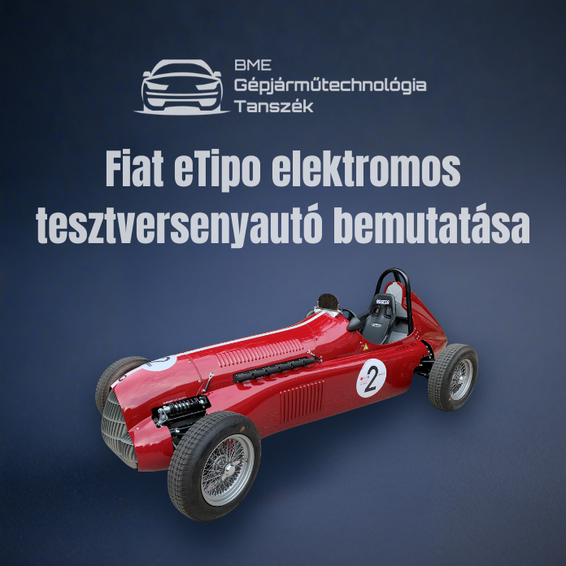

Az 1950-es éveket idéző, oldtimer formavilágú, ugyanakkor a legmodernebb hajtáslánccal felvértezett eTipo elektromos tesztversenyautó bemutatása

[Kondrat Péter](https://tudprog.bme.hu/kutatok_ejszakaja/profilok/kondrat_peter)

[BME KJK, Gépjárműtechnológia Tanszék](https://auto.bme.hu/)

