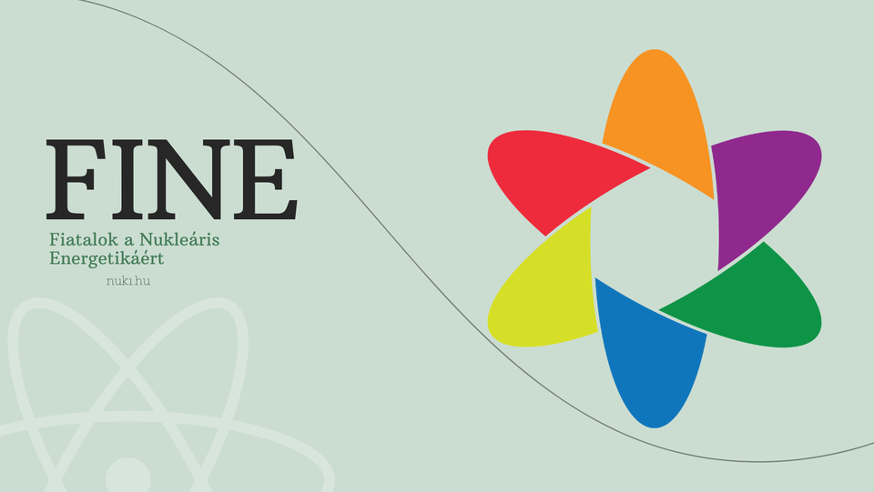

A FINE standján nukleáris energetikai kvízekkel, 3D-nyomtatott atomerőművi makettekkel és látványos radioaktivitási kísérletekkel várjuk az érdeklődőket. A kérdéseket közösen átbeszéljük, a kvízekért apró ajándékok is nyerhetők.

[Dr. Orosz Gergely Imre](https://tudprog.bme.hu/kutatok_ejszakaja/profilok/orosz_gergely_imre)

[BME TTK, Nukleáris Technikai Intézet](https://www.reak.bme.hu/)

