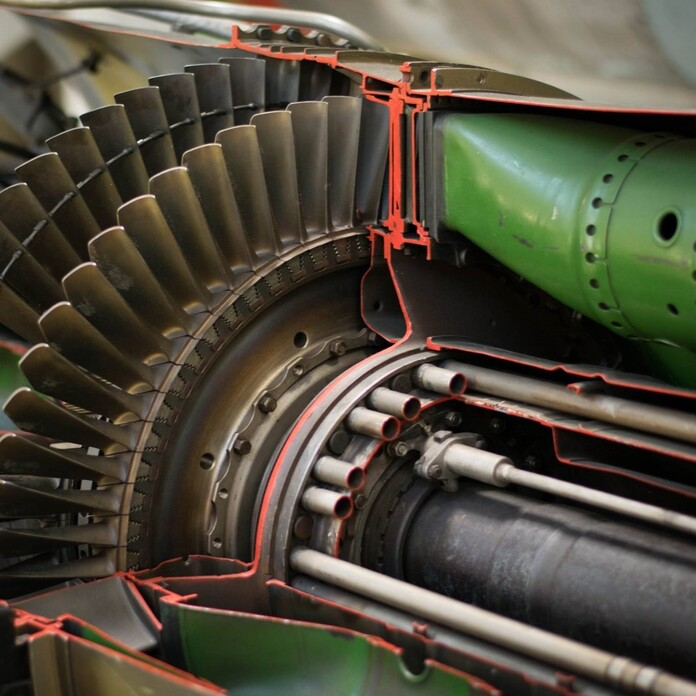

Merülj el a gázturbinák világában, ahol a szárazföldi energiatermelés és a repülés találkozik! A kiállított és működő turbináink segítségével megismerheted a technológia működését, fejlesztéseit és hatását a modern energiagazdálkodásra és légiközlekedésre.

[Dr. Sztankó Krisztián](https://www.energia.bme.hu/munkatarsak-3/sztankok/)

[BME GPK, Energetikai Gépek és Rendszerek Tanszék](https://www.energia.bme.hu/)

