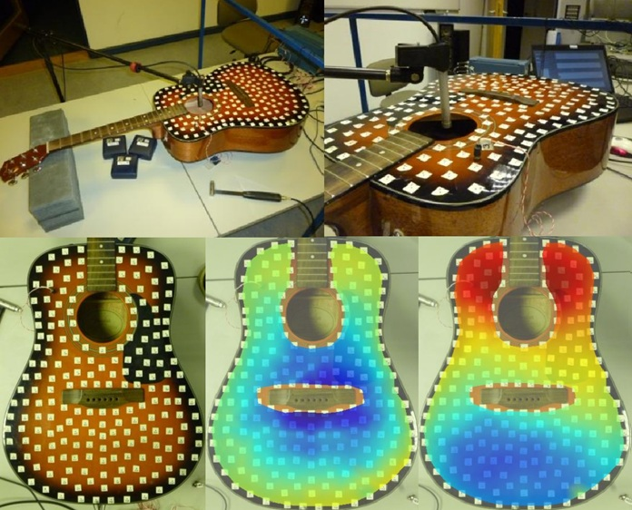

Hogyan segítheti a tudomány a hangszerkészítők munkáját? Megismerkedünk a hangszerek akusztikai mérésének és modellezésének világával, miközben demonstrációk bemutatásával igyekszünk megválaszolni az előbbi kérdést.

[Rucz Péter](https://tudprog.bme.hu/kutatok_ejszakaja/profilok/rucz_peter)

[BME VIK, Hálózati Rendszerek és Szolgáltatások Tanszék](https://www.hit.bme.hu/)

