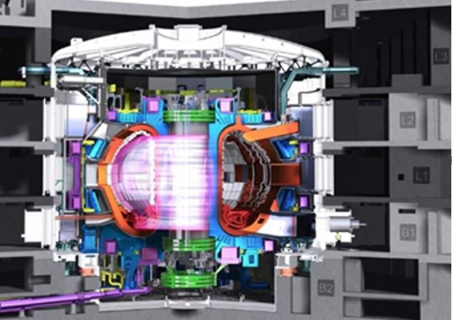

Az energiaigény növekedésével, és a fosszilis energiahordozók végességének tudatával az emberiség komoly kihívások elé néz energetikai téren. Az egyik lehetséges megoldás az úgynevezett magfúzió, az a folyamat, amellyel a csillagok termelik az energiát, így a mi Napunk is.

[Dr. Asztalos Őrs](https://www.reak.bme.hu/munkatars/oktatok/asztalos-ors.html)

[BME TTK, Természettudományi Kar](https://www.ttk.bme.hu/)

