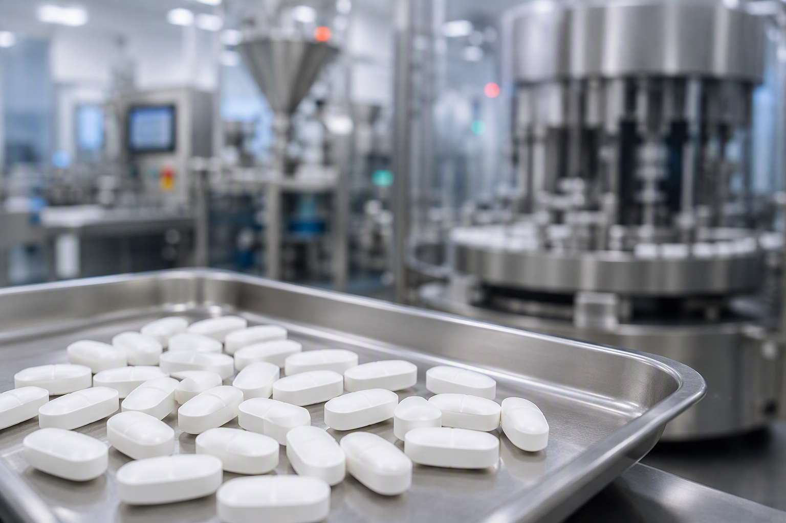

A laborlátogatás során az érdeklődők betekintést nyerhetnek a gyógyszergyártás folyamatába. Interaktív kísérletek segítségével bemutatjuk, hogy miből és hogyan készülnek a gyógyszertárban kapható tabletták.

[Dr. Galata Dorián](https://tudprog.bme.hu/kutatok_ejszakaja/profilok/galata_dorian), [Fekete Dániel](https://tudprog.bme.hu/kutatok_ejszakaja/profilok/fekete_daniel), [Szeip Judit](https://tudprog.bme.hu/kutatok_ejszakaja/profilok/szeip_judit)

[BME VBK, Szerves Kémia és Technológia Tanszék](https://oct.bme.hu/oct/hu)

