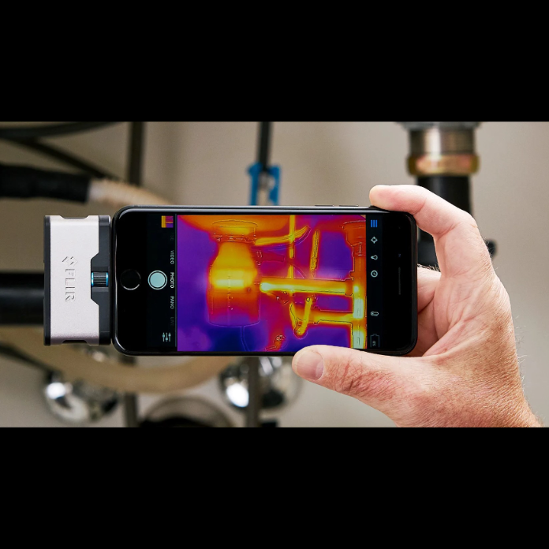

Fedezd fel a láthatatlan világot a hőkamera segítségével, és nézd meg, hogyan rajzolódik ki körülöttünk a hő lenyűgöző mintázata! Interaktív bemutatónkon kipróbálhatod a hőkamerát, és megtudhatod, hogyan segíti ez a különleges technológia a kutatást, az ipart és a mindennapi életet.

[BME GPK, Energetikai Gépek és Rendszerek Tanszék](https://www.energia.bme.hu/)

