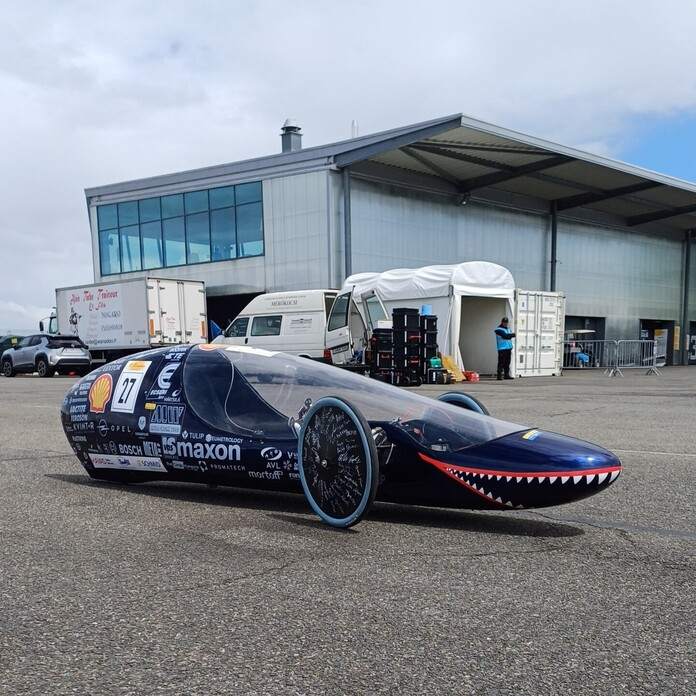

Léna vagyok, a SharkTeam dízel-hibrid versenyautója!  A Shell Eco-marathon pályáin azt bizonyítom, hogy egy jól megtervezett hibrid hajtáslánccal elképesztő üzemanyag-hatékonyság érhető el. A motoromat is a csapat tervezte és építette – gyere, nézz be a motorháztető alá!

Én vagyok Luna, a SharkTeam hidrogéncellás versenyautója! Bennem nem hagyományos motor, hanem egy teljesen saját fejlesztésű üzemanyagcella dolgozik, ami elektromos energiává alakítja a hidrogént – kipufogógáz helyett csak vízpára távozik belőlem. Ismerd meg, hogyan hajt engem a jövő technológiája

Csapatunk közel egy évtizedes tapasztalattal rendelkezik a Shell Eco-marathon enerigahatékonysági versenyen.
Saját fejlesztésű innovatív megoldásokkal küzdünk a jobb verseny eredményekért és egy tisztább, környezettudatosabb jövőért.
linkek: [sharkteam.hu](https://www.facebook.com/bmesharkteam), [Instagram](https://www.instagram.com/bme_sharkteam/),  [Linkedin](https://www.linkedin.com/company/bmesharkteam/), [Tiktok](https://www.tiktok.com/@bmesharkteam)

[BME GPK, Energetikai Gépek és Rendszerek Tanszék](https://www.energia.bme.hu/)

