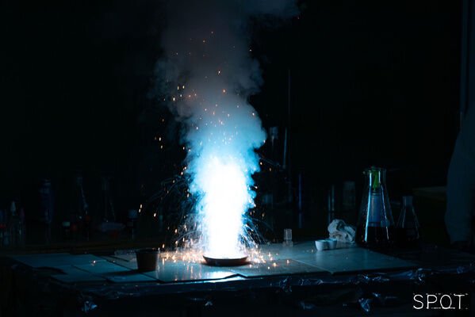

Olyan kémiát népszerűsítő kísérleteket láthatnak az érdeklődők, melyek színváltozással, fényjelenséggel, füsttel járnak. Minden korosztály számára érthetőek lesznek a magyarázatok, kémiai előismeretek sem szükségesek az előadás megtekintéséhez.

[Rapi Zsolt](https://tudprog.bme.hu/kutatok_ejszakaja/profilok/rapi_zsolt)

[BME VBK, Szerves Kémia és Technológia Tanszék](https://oct.bme.hu/)

