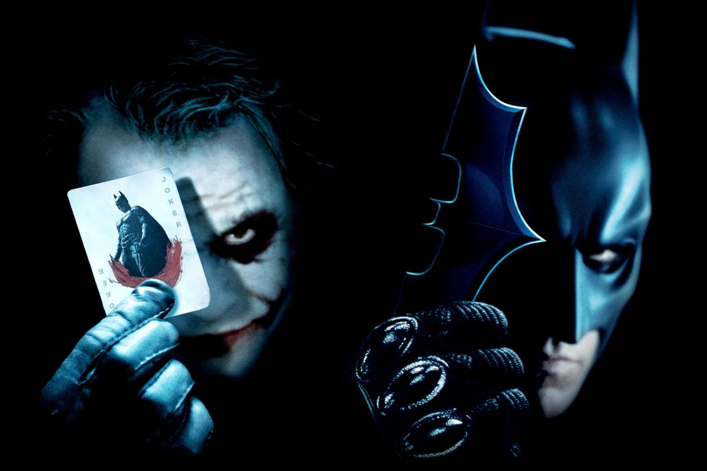

Őrült a Joker, vagy kiváló stratéga? A sötét lovag több mint szuperhősfilm. Leghíresebb jelenetei mögött valódi tudomány rejlik, a játékelmélet. Fedezzük fel közösen, milyen stratégiai csapdákat állít a Joker, és fejtsük meg a logikájukat.

[Nagy Gellért](https://tudprog.bme.hu/kutatok_ejszakaja/profilok/nagy_gellert)

[BME GTK FTT (Filozófia és Tudománytörténet Tanszék)](https://www.filozofia.bme.hu/)

