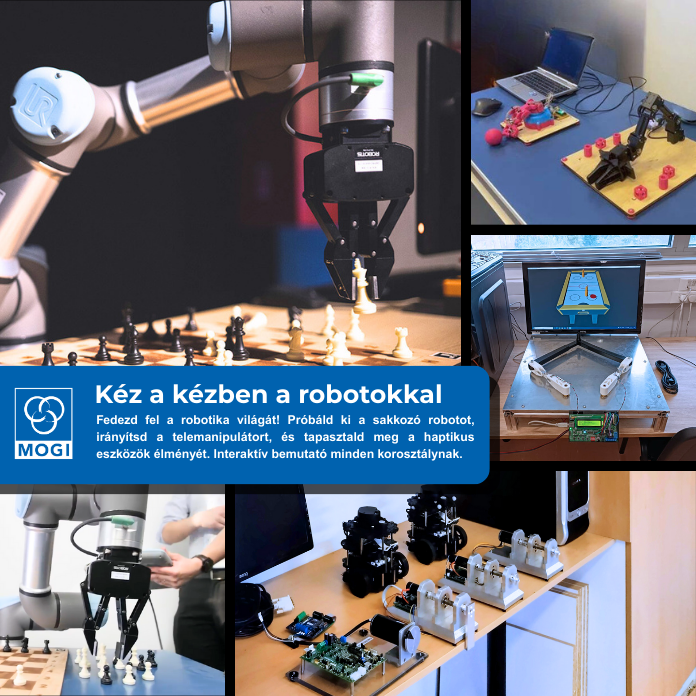

Fedezd fel a robotika világát! Próbáld ki a sakkozó robotot, irányítsd a telemanipulátort, és tapasztald meg a haptikus eszközök élményét. 
Interaktív bemutató minden korosztálynak.

[Dr. Budai Csaba](https://tudprog.bme.hu/kutatok_ejszakaja/profilok/budai_csaba), [Bertók Zsanett](https://tudprog.bme.hu/kutatok_ejszakaja/profilok/bertok_zsanett), [Nagy Vanda Orsolya](https://tudprog.bme.hu/kutatok_ejszakaja/profilok/nagy_vanda_orsolya)

[BME GPK, Mechatronika, Optika és Gépészeti Informatika Tanszék](https://www.mogi.bme.hu/)

