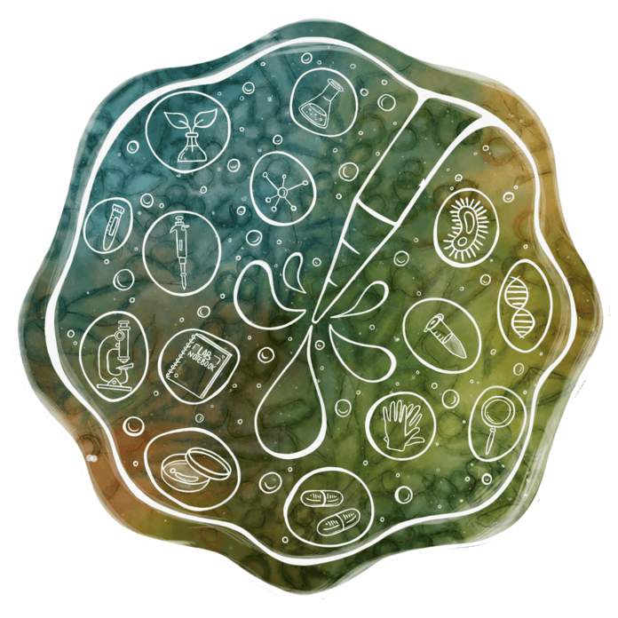

ELTE biológia alapképzés és BME biomérnök mesterszak után jelenleg a Biokémia és Molekuláris Biológia Kutatócsoport tagjaként végzem a PhD-m. A fő kutatási témáim a sejthalál folyamatok, citotoxikológiai vizsgálatok és ipari fehérje termelés. 

[Kurucz Bálint](https://tudprog.bme.hu/kutatok_ejszakaja/profilok/kurucz_balint)

[BME VBK, Alkalmazott Biotechnológia és Élelmiszertudományi Tanszék](https://www.ch.bme.hu/magunkrol/tanszekek/133/alkalmazott_biotechnologia_es_elelmiszertudomanyi_tanszek.html)

