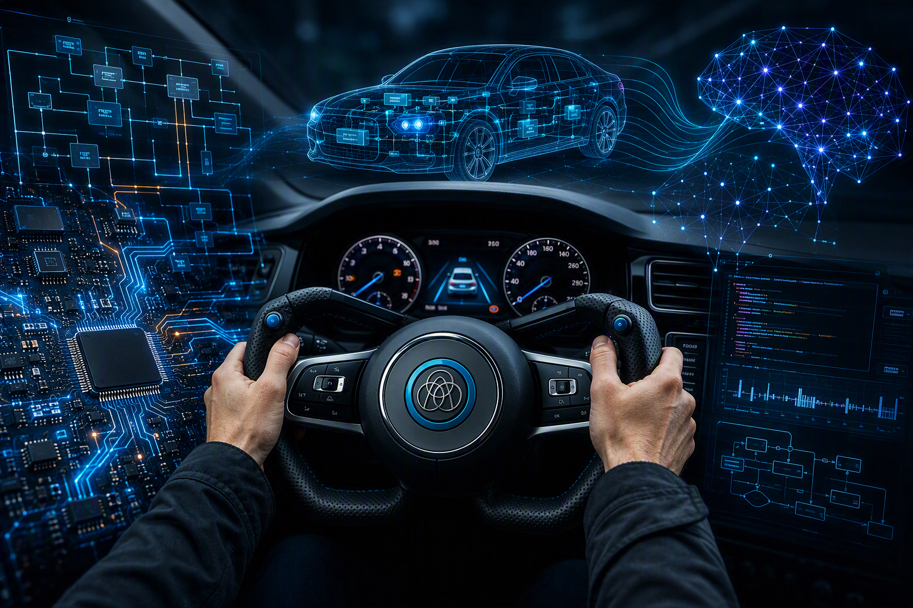

Két dolgot szeretnénk bemutatni a demóban. Egyrészt, hogy a mesterséges intelligencia módszereket miként lehet biztonságosan használni olyan rendszerek tervezésében, amelyek nem hibázhatnak. Továbbá a demóban azt is megmutatjuk, hogy a veztésben milyen informatikai megoldások felelősek a könnyű irányváltásért, és ezeknek miként lehet garantálni a megfelelő működését tervezési és futási időben. A demó a BME és a thyssenkrupp Kft.  Kompetencia Központban végzett munkáját mutatja be.

A  thyssenkrupp Automotive Technology budapesti leányvállalataként 1999 óta foglalkozunk személyautók elektromos kormányrendszerének fejlesztésével, a cégcsoporton belül egyedüli elektronikai és szoftverfejlesztési kompetenciaközpontként. Az iránt köteleztük el magunkat, hogy a neves autógyárak igényeit kiemelkedő minőségű, innovatív termékekkel elégítsük ki. Célunk, hogy kormányrendszerünk biztonságos legyen és tökéletes vezetési élményt nyújtson ügyfeleink számára.

[Dr. Vörös András](https://tudprog.bme.hu/kutatok_ejszakaja/profilok/voros_andras)

[BME VIK, Mesterséges Intelligencia és Rendszertervezés Tanszék](https://www.mit.bme.hu/)

