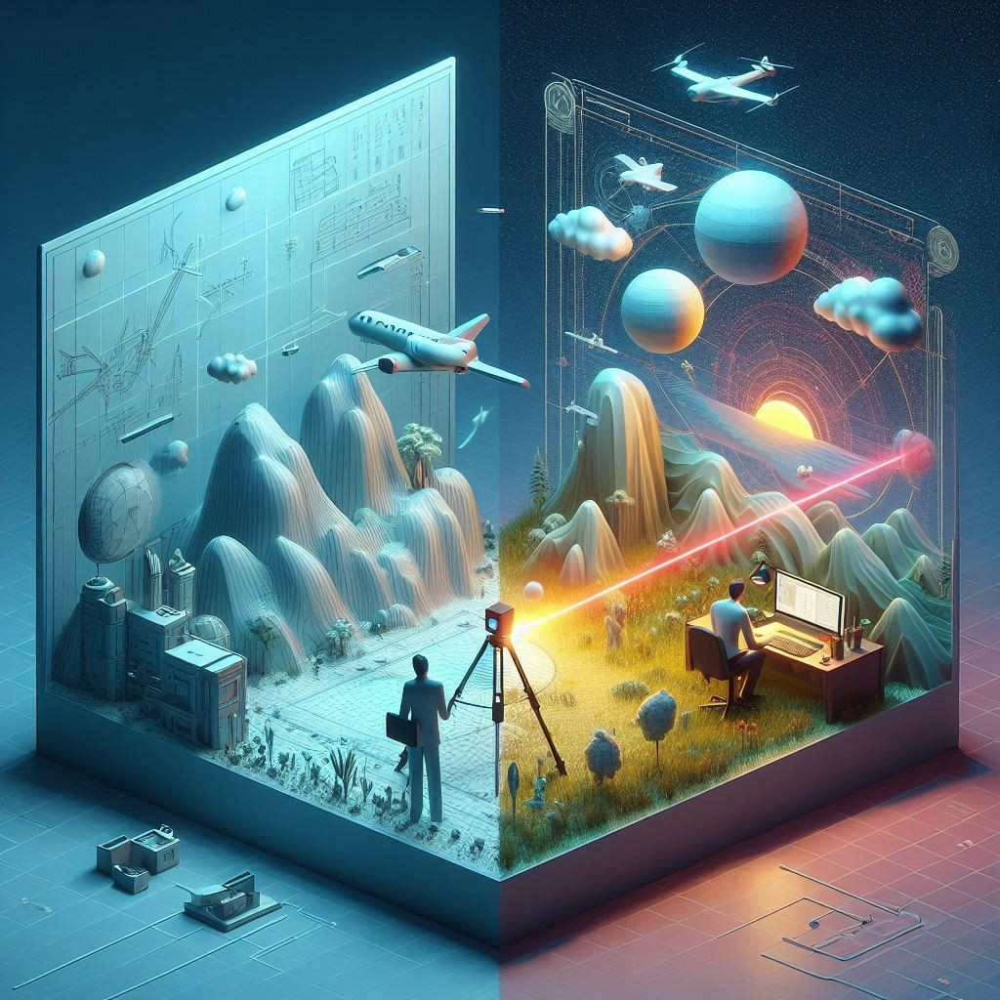

A résztvevők megismerkedhetnek a lézerszkennelés izgalmas világával. Bemutatjuk, hogyan készíthetünk 3D-s felvételeket a környezetünkről, és megvizsgáljuk, miként segít a technológia a természet és épületek pontos megfigyelésében.
A bemutatón optimálisan egyszerre 10 fő vehet részt, hogy mindenki számára garantált legyen a különleges élmény!

[Dr. Kugler Zsófia](https://epito.bme.hu/munkatarsak/23451), [Nagy Zoltán](https://epito.bme.hu/munkatarsak/23443), [Baranyai Dániel](https://epito.bme.hu/munkatarsak/23440)

[BME EMK, Fotogrammetria és Térinformatika Tanszék](ttps://epito.bme.hu/)

