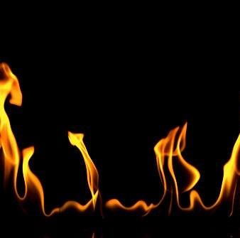

Hogyan szólhat egy láng, és hogyan tehetjük láthatóvá a szemmel láthatatlan légáramlatokat? Fedezd fel néhány egyszerű berendezés lenyűgöző világát, ahol a fizika látványos kísérleteken keresztül kel életre!

[BME GPK, Energetikai Gépek és Rendszerek Tanszék](https://www.energia.bme.hu/)

