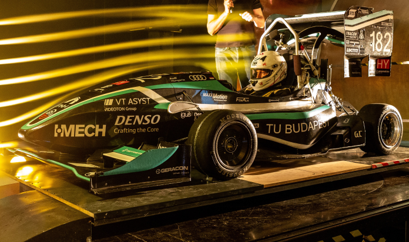

Megismerkedhetnek a szélcsatornás mérésekkel és érdekes áramlástani sajátosságokkal. Lehetőség van beállni a szélcsatorna közel 90 km/h sebességű levegőáramába. Továbbá látványos áramlástani bemutatók tekinthetők meg.

[Dr. Tokaji Kristóf](https://tudprog.bme.hu/kutatok_ejszakaja/profilok/tokaji_kristof), [Áramlástan Tanszék](https://www.ara.bme.hu/)

[BME GPK, Áramlástan Tanszék](https://www.ara.bme.hu/)

