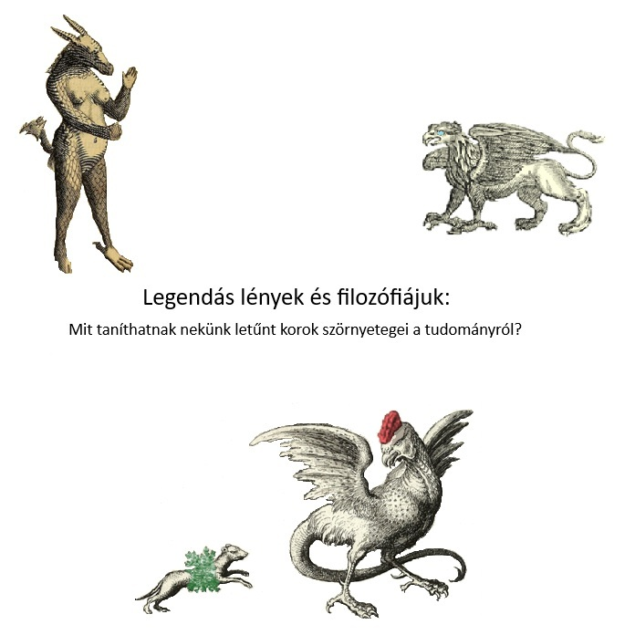

Vajon miért foglalkozott Newton sárkányokkal? És Leibniz unikornisokkal? Miért alkotta meg Linné a Homo Sapiens mellett a Homo Monstrosus kategóriáját is Systema Naturae c. nagy természettudományos munkájában? Mit taníthatnak nekünk letűnt korok szörnyetegei a tudományról?

[Bíró Gábor István](https://tudprog.bme.hu/kutatok_ejszakaja/profilok/biro_gabor_istvan)

[BME GTK, Filozófia és Tudománytörténet Tanszék](https://www.filozofia.bme.hu/)

