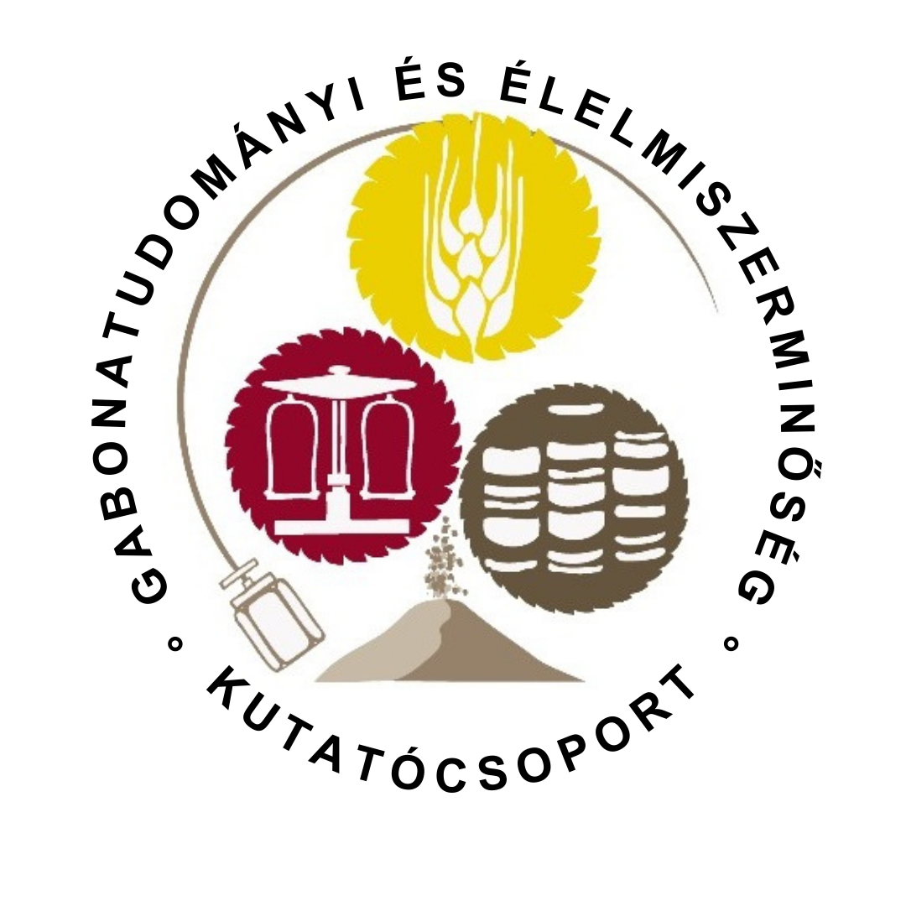

Mit csinál egy élelmiszerkutató? Alaposan utánajár annak, hogy miből készülnek az élelmiszerek, amiket megeszünk, mi befolyásolja alapanyagaink minőségét és biztonságát, új izgalmas termékeket fejleszt, és még sok minden mást. Az esemény a "Legyél Te is Biomérnök!" programsorozat része.

[Dr. Tömösközi Sándor](https://tudprog.bme.hu/kutatok_ejszakaja/profilok/tomoskozi_sandor), [Juhászné Dr. Szentmiklóssy Marietta Klaudia](https://tudprog.bme.hu/kutatok_ejszakaja/profilok/juhaszne_dr_szentmiklossy_marietta), [Dr. Jaksics Edina ](https://tudprog.bme.hu/kutatok_ejszakaja/profilok/jaksics_edina), [Szűcsné Makay Erika](https://tudprog.bme.hu/kutatok_ejszakaja/profilok/szucsne_makay_erika), [Gasparics Kata](https://tudprog.bme.hu/kutatok_ejszakaja/profilok/gasparics_kata), 
[Horváth Ábel Ruben](https://tudprog.bme.hu/kutatok_ejszakaja/profilok/horvath_abel_ruben), [Vértes Gábor Bendegúz](https://tudprog.bme.hu/kutatok_ejszakaja/profilok/vertes_gabor_bendeguz), [Vértes Gábor Bendegúz](https://tudprog.bme.hu/kutatok_ejszakaja/profilok/vertes_gabor_bendeguz)

[BME VBK, Alkalmazott Biotechnológia és Élelmiszertudományi Tanszék](https://abet.vbk.bme.hu/)

Szűcsné Makay Erika.jpg