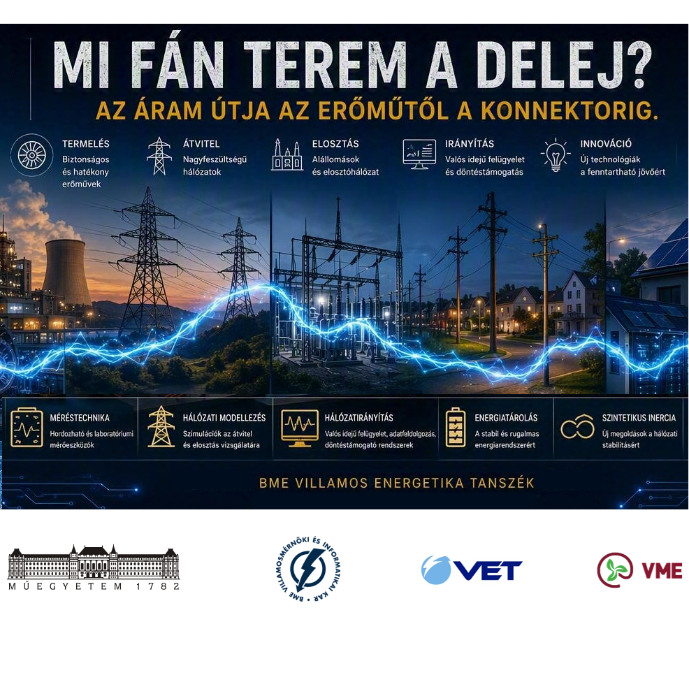

Ezzel a témával a közelmúltban megtapasztalt, szokatlanul kiélezett energetikai helyzetben felvetődött olyan kérdéseket célozzuk meg, mint pl. hogyan biztosítható a termelés és a fogyasztás egyensúlya, melyek az villamos áram útjára vonatkozó fizikai kényszerek, hol tudunk beavatkozni a rendszerbe. Egy történetre felfűzve a laborlátogatáson megismerhetők a klasszikus forgógépes energiaátalakítás, valamint a villamosenergia-átvitel és -elosztás alapelvei. Bemutatjuk a hálózaton használt nagyteljesítményű eszközök laboratóriumi modelljét és a hálózati mennyiségek vizsgálatára alkalmas mérőeszközöket. 
A látogatás részeként bepillantást nyújtunk a korszerű technológiák - mint pl. az energiatárolás, naperőműves termelés, energiaközösségek, szintetikus inercia leképezés - működésébe.

[Horváth Sándor](https://tudprog.bme.hu/kutatok_ejszakaja/profilok/horvath_sandor)

[BME VIK, Villamos Energetika Tanszék](https://vet.bme.hu/)

