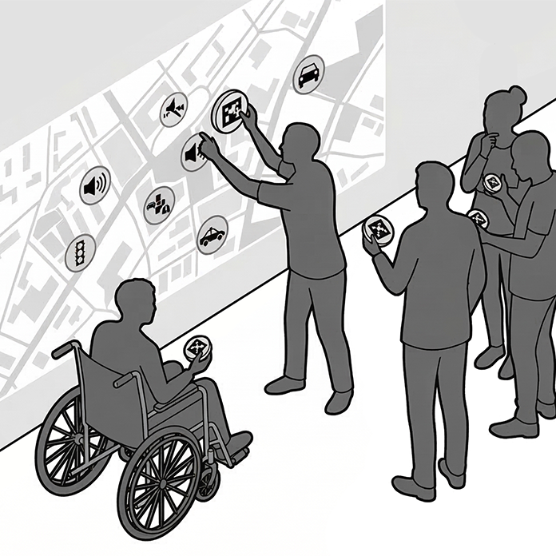

Hogyan segíti az MI az élhetőbb városok tervezését? Ismerd meg, miként válnak a városi adatok és okos algoritmusok közösségi döntésekké. Építészet és alkalmazott informatika találkozása a jövő tereinek szolgálatában.

[Dongó Tamás](https://tudprog.bme.hu/kutatok_ejszakaja/profilok/dongo_tamas)

[BME VIK Automatizálási és Alkalmazott Informatikai Tanszék](https://www.aut.bme.hu/)

