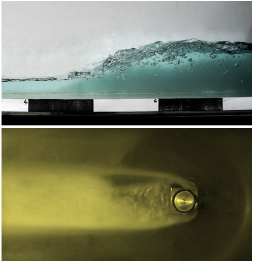

Mi a közös egy tönkrement hajócsavar és egy hangos vízforraló között? Hogyan alakul ki egy nyíltfelszínű hullám? 
Kísérleti berendezéseinken bemutatjuk ezen szép, de olykor pusztító erejű áramlástani jelenségeket. 

[Gulyás András](https://tudprog.bme.hu/kutatok_ejszakaja/profilok/gulyas_andras), [Dr. Csizmadia Péter](https://tudprog.bme.hu/kutatok_ejszakaja/profilok/csizmadia_peter), [Kalmár Péter](https://tudprog.bme.hu/kutatok_ejszakaja/profilok/kalmar_peter),
[Nagy Dániel](https://tudprog.bme.hu/kutatok_ejszakaja/profilok/nagy_daniel)

[BME GPK, Hidrodinamikai Rendszerek Tanszék](https://www.hds.bme.hu/)

