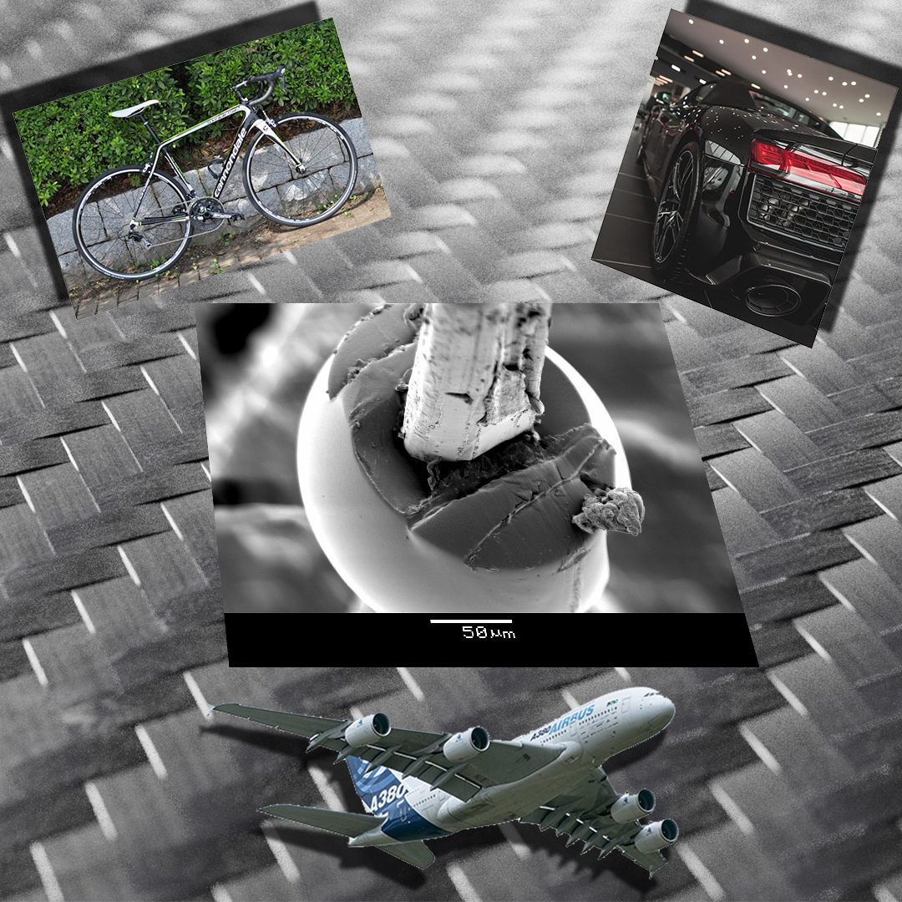

A 3D nyomtatás ma már nemcsak látványos hobbi: egyedi alkatrészek, kompozit szerkezetek, orvosi implantátumok, sőt akár gyártóeszközök is készülhetnek vele. De hogyan lesz egy valódi tárgyról vagy akár egy emberről digitális 3D modell? A program során ezt is megmutatjuk: egy önként jelentkező látogató fejéről 3D szkennerrel digitális modellt készítünk.
A laborlátogatás során a résztvevők többféle 3D nyomtatási technológiával és különleges alapanyaggal is találkozhatnak. Megmutatunk többek között színváltó, fával töltött, újrahasznosított PET-palackból készült és nyomtatás közben felhabosodó filamenteket, valamint azt is, hogyan készíthetők folytonos szálerősítésű kompozit alkatrészek. Betekintést adunk a műgyantás 3D nyomtatás különböző technológiáiba, megmutatjuk, hogyan használhatók 3D nyomtatott szerszámbetétek a fröccsöntésben, és hogyan lehet egy 3D nyomtatott elemre további anyagot ráfröccsönteni. 
Emellett néhány, ízületi implantátumokhoz kapcsolódó kutatási alkalmazást is bemutatunk.

[Pinke Balázs Gábor](https://tudprog.bme.hu/kutatok_ejszakaja/profilok/pinke_balazs_gabor), [Dr. Morlin Bálint](https://tudprog.bme.hu/kutatok_ejszakaja/profilok/morlin_balint)

[BME GPK Polimertechnika Tanszék](https://www.pt.bme.hu/fooldal.php?l=m)

