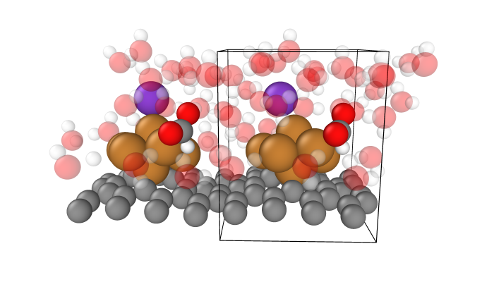

A látogatók megtekinthetik a SZTAKI és a BME által fejlesztett önvezető tesztautót, amellyel az önvezető járművek "mixed reality"-t alkalmazó tesztelési folyamatai kerülnek bemutatásra. 
A jármű a parkolóban működés közben, akár utasként is kipróbálható.

[Antal Balázs](https://tudprog.bme.hu/kutatok_ejszakaja/profilok/antal_balazs), [Haffner Ádám Balázs](https://tudprog.bme.hu/kutatok_ejszakaja/profilok/haffner_adam_balazs)

