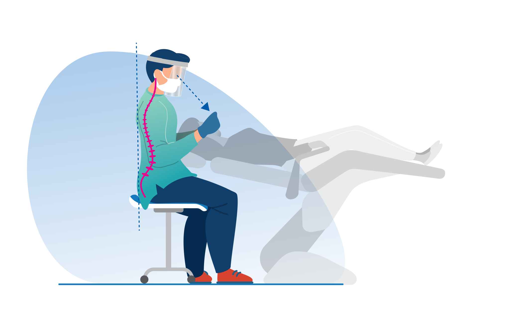

Pelle Rita doktori kutatásának módszertanát és eredményeit mutatja be poszter formájában, a fogászati ergonómia és biomechatronika területéről. A kutatás a fogorvosi munkavégzés testhelyzeteinek biomechanikai elemzésével foglalkozik.
A felvételek marker-alapú és markermentes mozgásrögzítéssel készülnek, az ízületi szögek meghatározása utólagos jelfeldolgozással történik OpenSim és Python környezetben. 
A bemutató a módszertan, az eredmények és a további kutatási irányok áttekintésére nyújt lehetőséget.

[Pelle Rita](https://tudprog.bme.hu/kutatok_ejszakaja/profilok/pelle_rita)

[BME GPK, Mechatronika, Optika és Gépészeti Informatika Tanszék](https://www.mogi.bme.hu/)

