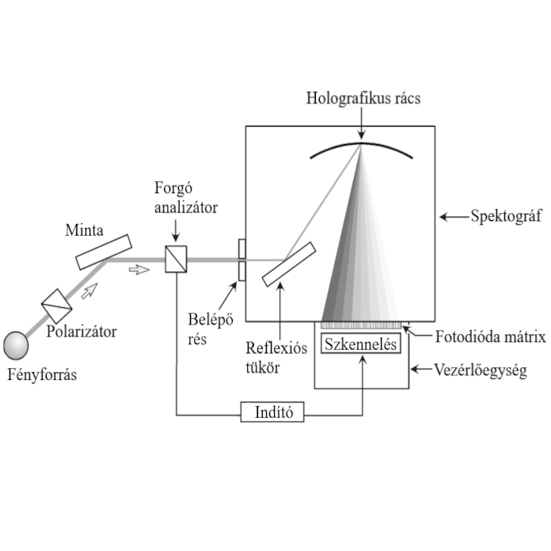

Hogyan vizsgálhatunk meg olyan vékonyrétegeket, amelyek tízezerszer vékonyabbak egy hajszálnál? Az ellipszometria egy roncsolásmentes optikai módszer, amely nanométeres felületek és akár atomi vastagságú rétegek tulajdonságait tárja fel. Ma már az elektronikai ipartól a napelemekig számos területen használják – az előadásban kiderül, hogyan működik a gyakorlatban.

[Stift Máté Kálmán](https://tudprog.bme.hu/kutatok_ejszakaja/profilok/stift_mate_kalman)

[BME VIK, Elektronikai Technológia Tanszék](https://www.ett.bme.hu/)

