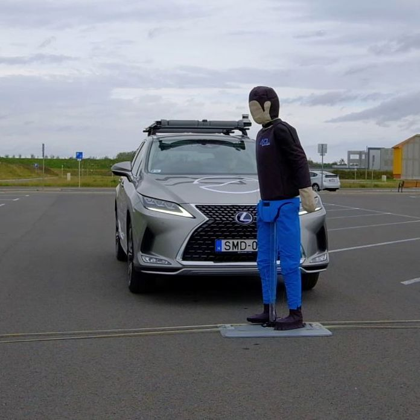

A látogatók megtekinthetik a SZTAKI és a BME által fejlesztett önvezető tesztautót, amellyel az önvezető járművek "mixed reality"-t alkalmazó tesztelési folyamatai kerülnek bemutatásra. 
A jármű a parkolóban működés közben, akár utasként is kipróbálható.

[Dr. Aradi Szilárd](https://tudprog.bme.hu/kutatok_ejszakaja/profilok/aradi_szilard), [Dr. Fehér Árpád](https://tudprog.bme.hu/kutatok_ejszakaja/profilok/feher_arpad)

[BME KJK, Közlekedés- és Járműirányítási Tanszék](https://kjit.bme.hu/index.php/hu/)

