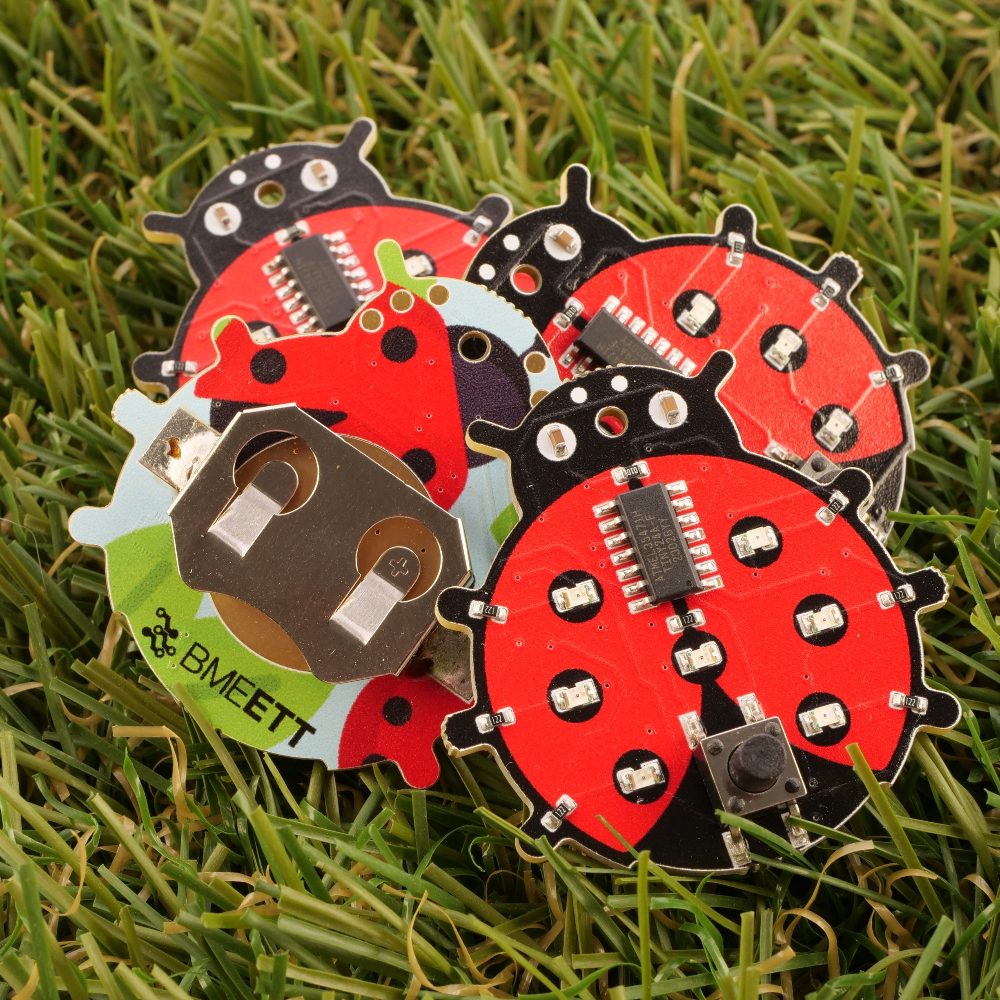

Van már digitális dobókockád a korábbi évekből? Vagy most ismerkedsz a programozás világával? Bármelyikre is igen a válasz, nálunk a helyed!Tanszékünk idén egy új, izgalmas programmal várja az érdeklődőket, ahol megmutatjuk, hogyan lehet egy egyszerű, villogó áramkört felprogramozni és életre kelteni. A foglalkozás során betekintést nyerhetsz az Arduino fejlesztői környezet használatába, majd közösen elkészítjük a digitális dobókocka programját is. De az elektronika és a programozás mellett egy másik fontos témát is megismerhetsz: a fenntarthatóságot. A programozáshoz használt fejlesztőpanelek ugyanis a Tanszékünk aktív kutatásának részeként, lebomló hordozón készültek. Így a programozás mellett azt is megmutatjuk, hogyan lehet az elektronika zöldebb. Gyere el, és fedezd fel velünk, hogyan találkozik a programozás, az elektronika és a fenntarthatóság!

[Fehér László](https://tudprog.bme.hu/kutatok_ejszakaja/profilok/feher_laszlo), [Havellant Gergő](https://tudprog.bme.hu/kutatok_ejszakaja/profilok/havellant_gergo), [Bátorfi Réka](https://tudprog.bme.hu/kutatok_ejszakaja/profilok/batorfi_reka)

[BME - ETT,  Elektronikai Technológia Tanszék](https://www.ett.bme.hu/)

