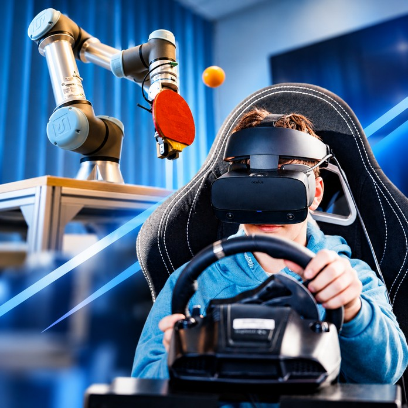

Mi kell ahhoz, hogy egy robot pingpongozni tudjon? Hogyan tájékozódik egy robotjármű? 
Gépi látás alapú objektumfelismerés és mozgáspredikció, robotkarok valósidejű irányítása, autóvezetés távolról VR sisakban: Megmutatjuk, sőt ki is próbálhatod!

[Dr. Kiss Domokos](https://tudprog.bme.hu/kutatok_ejszakaja/profilok/kiss_domonkos), [Dr. Nagy Ákos](https://tudprog.bme.hu/kutatok_ejszakaja/profilok/nagy_akos), 
[Kiss Ágoston](https://tudprog.bme.hu/kutatok_ejszakaja/profilok/kiss_agoston), [Hartmann Ábel](https://tudprog.bme.hu/kutatok_ejszakaja/profilok/hartmann_abel)

[BME VIK, Automatizálási és Alkalmazott Informatikai Tanszék](https://www.aut.bme.hu/)

